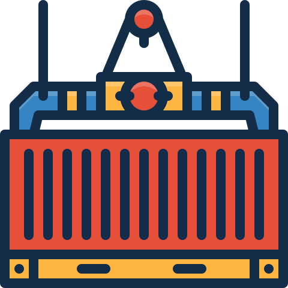
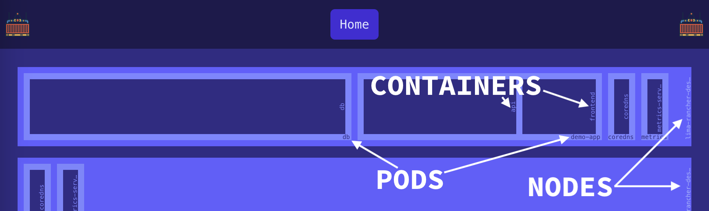

<div align="center">
  <a href="#">
    
  </a>

  <h3 align="center">Pod Storage Yard (PSY)</h3>

  <p align="center">
    A modern, real-time visualization tool for Kubernetes cluster resource allocation
  </p>
</div>

## About The Project

Pod Storage Yard (PSY) is a Kubernetes visualization tool designed to provide a clear, hierarchical view of resource allocation across your clusters. It addresses the common challenge of understanding CPU resource distribution across nodes, pods, and containers in large Kubernetes deployments.

## Overview



### Key Features

- **Hierarchical Visualization**: Nested view of clusters → nodes → pods → containers
- **Resource-Based Sizing**: Visual elements sized proportionally to CPU allocation
- **Real-Time Information**: Hover-based detailed information about containers
- **Multi-Cluster Support**: Capability to view multiple cluster contexts
- **Resource Metrics**: CPU requests and limits visualization
- **Container Status**: Live status information for each container

### Built With

- [SvelteKit](https://kit.svelte.dev) - Full-stack application framework
- [TypeScript](https://www.typescriptlang.org) - Type-safe JavaScript
- [Kubernetes Client](https://github.com/kubernetes-client/javascript) - Official Kubernetes client
- [TailwindCSS](https://tailwindcss.com) - Utility-first CSS framework

## Getting Started

### Prerequisites

- [mise](https://mise.jdx.dev) - Development environment manager
- Access to a Kubernetes cluster (local or remote)
- Valid kubeconfig with appropriate permissions

### Installation

1. Clone the repository

   ```sh
   git clone https://github.com/jbgachot/psy.git
   cd psy
   ```

2. Setup Node.js environment with mise

   ```sh
   # mise will automatically pick up the .mise.toml configuration
   mise install
   ```

3. Install dependencies

   ```sh
   npm install
   ```

4. Start the development server
   ```sh
   npm run dev
   ```

### Configuration

PSY uses your default kubeconfig file for cluster access. Ensure your kubeconfig is properly configured:

```sh
# Verify your current context
kubectl config current-context

# List available contexts
kubectl config get-contexts
```

## Architecture

PSY follows a hierarchical data model that mirrors the Kubernetes resource hierarchy:

```
Cluster
└── Node
    └── Pod
        └── Container
```

Each level maintains its own state and proportionally sizes its elements based on CPU resource allocation. The application processes the raw Kubernetes API data through the following pipeline:

1. Data Collection: Fetches node and pod information using the Kubernetes API
2. Resource Calculation: Processes CPU requests and limits
3. Size Computation: Calculates relative sizes for visual representation
4. State Management: Maintains a reactive state tree using Svelte stores

## License

Distributed under the MIT License. See `LICENSE` for more information.
